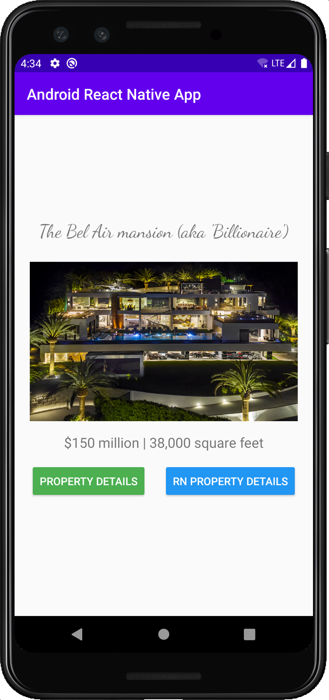
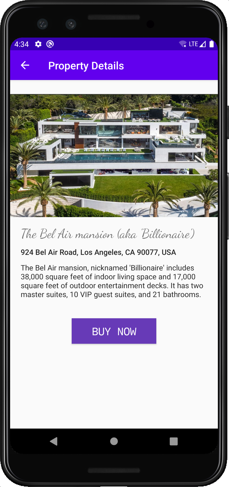

# Android React Native app

This repo serves as a reference for integrating React Native into a brand new Android app.

The official React Native docs to integrate in an Android app are outdated and inaccurate. I have created a issue to get them updated here: https://github.com/facebook/react-native-website/issues/2118

## Setup Android app

- Create a new Android app using the "No Activity" template.
- Set the minimum SDK version to 23
- Delete the un-used tests.

The app won't run intially as it doesn't have the `MainApplication` and/or `MainActivity` files. This serves as a starting point for the app and so it will fail with *"Default Activity not found"*.

Next go ahead and create the `MainApplication.java` and `MainActivity.java` classes. [This commit adds it](https://github.com/Monte9/android-react-native-app/commit/de1cca2fd293e3103e3538ec0e0400370bc0dd08).

Go ahead and build and run the app and you should see a simple Android app with a navigation bar title that says "**Android React Native App**".

You now have a working Android application. :clap:

### Add Native UI and Screens

Our Android app serves as a **Property Guide**. The user will land on the **Property** screen, which will be a **native Java screen**.

This screen will have two buttons:

- The first button **Property Details** will navigate the user to the Property Details screen. This will be a **native Java screen**.
- The second button **RN Property Details** will also navigate the user to the Property Details screen. This will be a **fully React Native screen**.

Let's start by getting the native Property and Property Details screen setup. You can [checkout this commit](https://github.com/Monte9/android-react-native-app/commit/5fbf769bce637d177fb09195675f619722e55311) which adds it.

Here's what the completed native screens look like:

<div style="display: flex; flex-direction: row">


</div>

## Setup React Native

The following setup uses `"react-native": "^0.63.2"` although it should be the same if you are on React Native `v0.60+`.

- Create a `package.json` in the root

    ```js
    {
        "name": "android-react-native-app",
        "version": "1.0.0",
        "private": true,
        "scripts": {
            "start": "yarn react-native start",
            "android": "yarn react-native run-android"
        }
    }
    ```

- Install the following packages

    ```sh
    yarn add react-native
    yarn add react@version_printed_above
    yarn add hermes-engine
    yarn add jsc-android
    ```

- Add the following code to `/app/build.gradle` file

    ```java
    // Add this ABOVE the dependencies section
    project.ext.react = [
        entryFile: "index.js" ,
        enableHermes: false,
    ]

    def jscFlavor = 'org.webkit:android-jsc:+'
    def enableHermes = project.ext.react.get("enableHermes", false);

    // Add this WITHIN the dependencies section
    implementation 'com.android.support:appcompat-v7:28.0.0'
    implementation "com.facebook.react:react-native:+" // React Native

    if (enableHermes) {
        def hermesPath = "../node_modules/hermes-engine/android/";

        debugImplementation files(hermesPath + "hermes-debug.aar")
        releaseImplementation files(hermesPath + "hermes-release.aar")
    } else {
        implementation jscFlavor
    }

    debugImplementation("com.facebook.flipper:flipper:${FLIPPER_VERSION}") {
        exclude group:'com.facebook.fbjni'
    }

    debugImplementation("com.facebook.flipper:flipper-network-plugin:${FLIPPER_VERSION}") {
        exclude group:'com.facebook.flipper'
        exclude group:'com.squareup.okhttp3', module:'okhttp'
    }

    debugImplementation("com.facebook.flipper:flipper-fresco-plugin:${FLIPPER_VERSION}") {
        exclude group:'com.facebook.flipper'
    }

    // At this at the BOTTOM of the file
    // This sets up React Native AutoLinking on Android
    apply from: file("../node_modules/@react-native-community/cli-platform-android/native_modules.gradle"); applyNativeModulesAppBuildGradle(project)
    ```

- Add the following code to `build.gradle` file

    ```java
    // Add this INSIDE allprojects -> repositories
    // Make sure it's above all other maven repositories
    maven {
        // All of React Native (JS, Android binaries) is installed from npm
        url ("$rootDir/node_modules/react-native/android")
    }
    maven {
        // Android JSC is installed from npm
        url("$rootDir/node_modules/jsc-android/dist")
    }
    ```

- Define your FLIPPER version in `gradle.properties`

    ```java
    # Flipper version used by React Native
    FLIPPER_VERSION=0.33.1
    ```

- Setup AutoLinking in `settings.gradle` file

    ```java
    apply from: file("node_modules/@react-native-community/cli-platform-android/native_modules.gradle"); applyNativeModulesSettingsGradle(settings)
    ```

- Since the Android app is at the root, we need to setup `react-native.config.js` to tell the React Native CLI to look at the root.

    ```js
    module.exports = {
        project: {
            android: {
                sourceDir: './'
            }
        }
    };
    ```

Finally run `./gradlew clean` on the terminal and **Sync Gradle** (the "elephant with down-arrow" icon on the top right on Android Studio).

If the gradle sync works and you are able to run the app again - you are on the right track! :tada:

Otherwise something might have changed in the RN Android setup :confused:

- Either open a issue on this repo and I can investigate or
- Debug the issue and submit a PR to this repo to update the instructions

You can view all the changes needed in [this commit]().
